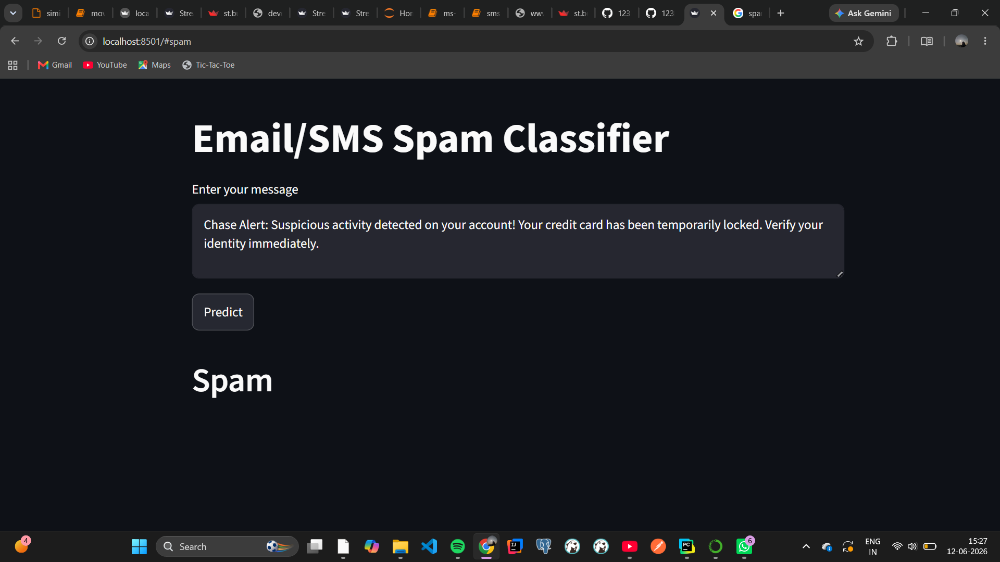
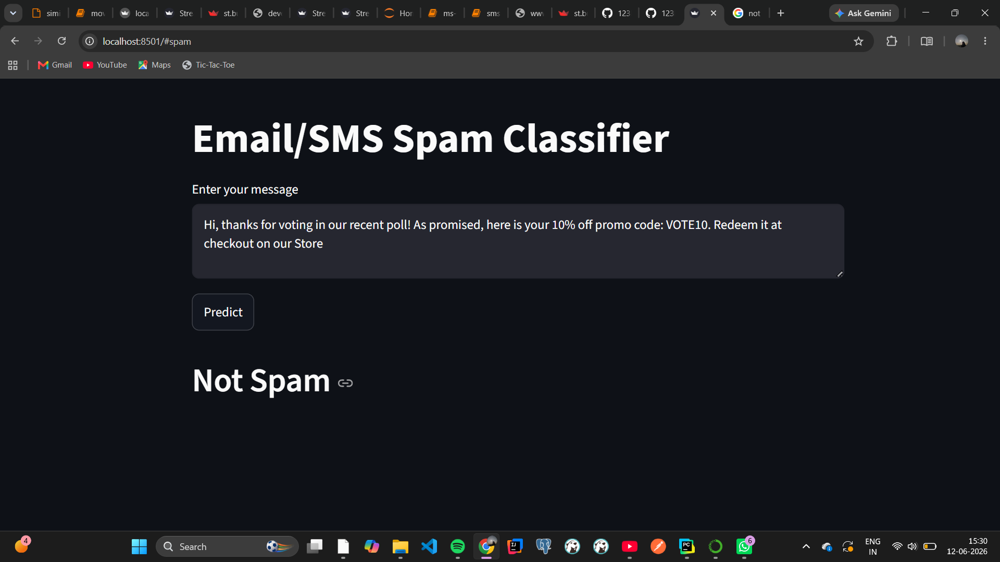

# SMS Spam Detection

A Machine Learning project that classifies SMS messages as Spam or Not Spam.

## Technologies Used
- Python
- Streamlit
- Scikit-learn
- NLTK

## Features
- Real-time spam detection
- User-friendly Streamlit interface

## Home Page

## Spam Detection Example

## Not Spam Example

